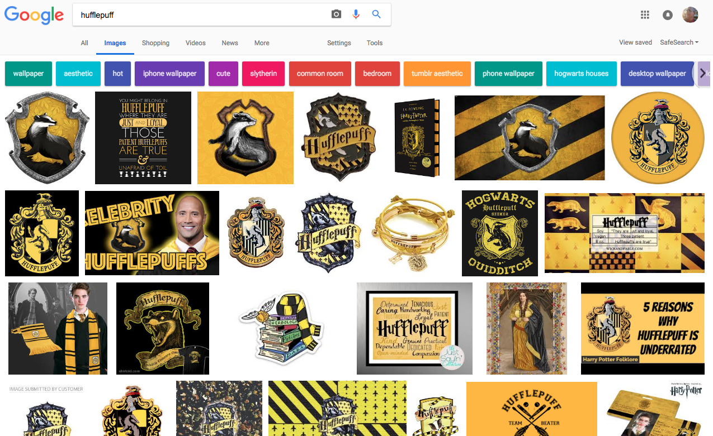

# Color Schemes for Launch Day June 4, 2018

## 1. Colors!

### PRACTICAL PROTOTYPE

Here is my final prototype. See image for html classes and hex codes:

[Prototype colors](./griffinpuff_colors_june_1.png "Prototype colors")

Resource for [Materialize Colors](https://materializecss.com/color.html) available from the CDN. 

##### We can use the Materialize shortcuts above for our prototype. Saves time!

### First draft

[https://coolors.co/e8bd3c-9d002f-fc9eb3-00c5db-00768b](https://coolors.co/e8bd3c-9d002f-fc9eb3-00c5db-00768b)

(All colors sampled directly from research images below.)

### Second Drafts

A.
[http://colorpalettes.net/color-palette-3785/](http://colorpalettes.net/color-palette-3785/)

B.
[http://colorpalettes.net/color-palette-3795/](http://colorpalettes.net/color-palette-3795/)

C.
[http://colorpalettes.net/color-palette-3855/](http://colorpalettes.net/color-palette-3855/)

### Blue-based

Tricolor split

(http://paletton.com/#uid=33x0E0klPl-s+6gpxdOidsSeqI7)http://paletton.com/#uid=33x0E0klPl-s+6gpxdOidsSeqI7]

### Red-based options

Tricolor split 

(http://paletton.com/#uid=33s0u0kllllaFw0g0qFqFg0w0aF)[http://paletton.com/#uid=33s0u0kllllaFw0g0qFqFg0w0aF]

Adjacent tricolor 

(http://paletton.com/#uid=55y0J0kllllaFw0g0qFqFg0w0aF)[http://paletton.com/#uid=55y0J0kllllaFw0g0qFqFg0w0aF]

### Pink-based

Tricolor split

(http://paletton.com/palette.php?uid=35l0J0k5rP500%2B%2B2eXM9oBFeLr4)[http://paletton.com/#uid=55y0J0kllllaFw0g0qFqFg0w0aF]

## 2. Research

### Reading:

* Wikipedia for [Griffin](https://en.wikipedia.org/wiki/Griffin). The disambiguation page reminded me about "Peter Griffin" and other alternate meanings. :- )

### Dictionary definitions (Merriam-Webster)

For "griffin":

For "puff":

### Image search:

Gryffindor:

Hufflepuff:

Jigglypuff:

Griffins in general:

Puffs in general:

End.